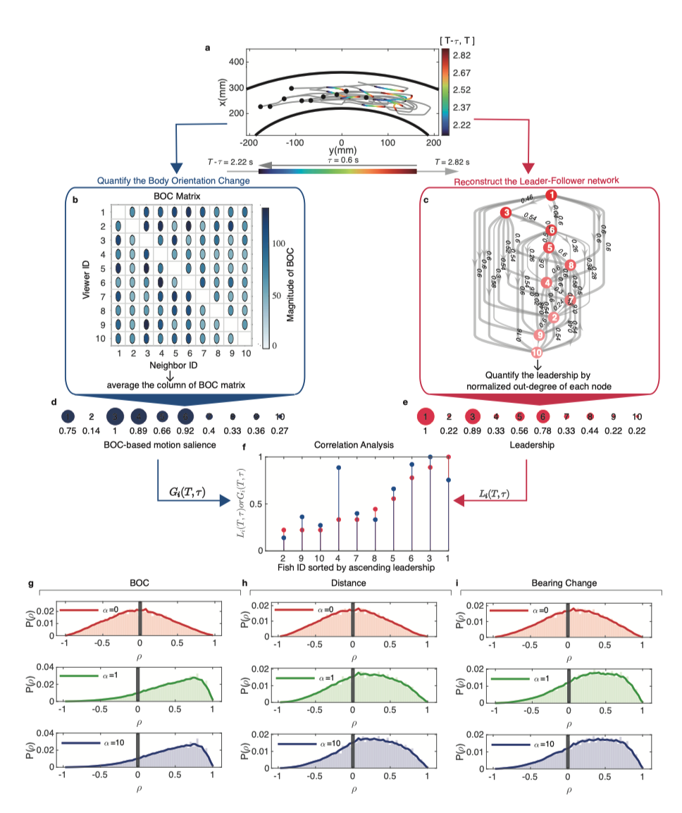
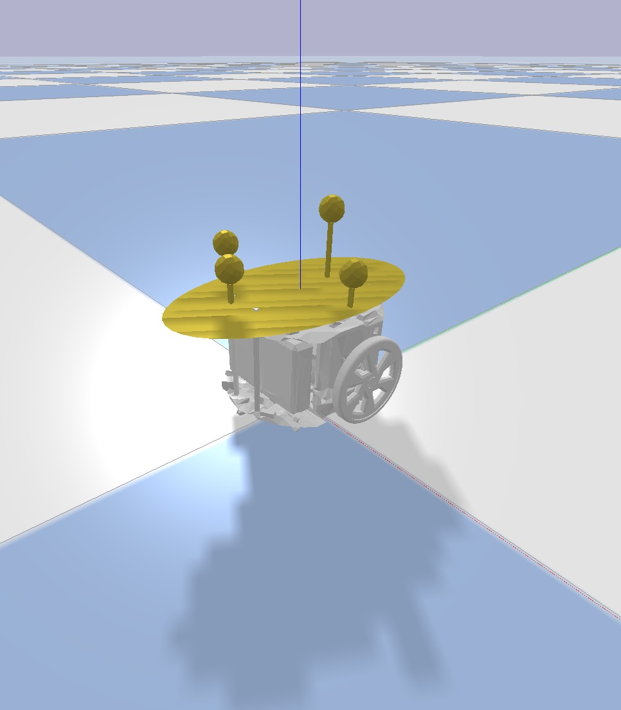

## Overview
In this repository, we have included the codes and example data capable of reproducing the primary content found in both the main text and supplementary information. 
Additionally, we have provided the codes to reproduce the simulation experiments of collective spin and collective turn in [pybullet simulator](https://github.com/bulletphysics/bullet3).
Moreover, due to the technical complexity involved in developing code for microcontrollers with C++, which may pose challenges for researchers without experience in embedded systems development when attempting to use the SwarmBang robot, we have provided the similar robotic control code based on pybullet simulators with the 3D physics model of our robots. 
The provided programs mirror the codes used in the server computer and microcontrollers to control the motion of robots, ensuring a close alignment of kinematic characteristics between simulation and real robot experiments.
Furthermore, we divided the codes into 8 parts to reproduce the results of our work: 1) results of empirical data analysis; 2) simulation results of collective spin; 3) results of collective turn; 3) simulation codes for collective spin; 4) simulation codes for collective turn; 5) results of robotic experiments; 6) the 3D physics model of SwarmBang robots; 7) requisite data; 8) tool codes.

## Software requirements

The codes provided in this repository are written in two programming languages on the platform of MacOS M1 Pro:

1.  MATLAB codes for analyzing the data and plotting;
2.  python codes (version = 3.8.13), for the simulation experiments of collective spin and collective turn in the pybullet simulator and mirrored robot control code from the microcontroller.

Additionally, the 3D physics model of the SwarmBang robot is described by the URDF file and the relevant STL file, which are built in the SolidWorks 2021.

## Installation Guide

### Python Dependencies

To make it easier for other researchers to reproduce the simulation experiments, we provide a list of Python dependency libraries in requirements.txt. 

```python
pip install -r requirements.txt 
```

## Empirical data analysis

By using the code "empirical\_analysis.m" and "draw\_distribution\_of\_rho.m", we can reproduce the results as follows: For a given U-turn trajectory and the time 𝑇 = 2.82 and time delay 𝜏 = 0.6, we could construct the BOC matrix and the leader-follower network within this period trajectory \[2.22s, 2.82s]. The analyzed part of the trajectory is drawn with a gradient color.
Consequently, we derived the average BOC and leadership of each individual, respectively. Interestingly, two vectors composed of  and  show highly positive correlation.
Finally, we performed the Spearman correlation (𝜌) between two vectors over the different combinations of 𝑇 and 𝜏. The distribution of 𝜌 over different combinations of 𝑇 and 𝜏 for BOC, distance and bearing change with 𝛼 = 0, 𝛼 = 1 and 𝛼 = 10, respectively.
By using the code "draw\_spatial\_distribution\_turning\_rank.m", we can reproduce the front-to-back information transfer direction during U-turn.
By using the code "draw\_effect\_aspect\_ratio.m", we can validate the effect of aspect ratio on the empirical analysis.
By using the code "draw\_corr\_Lt\_turning\_rank.m", we can validate the effectiveness of L\_t in empirical analysis.



## Collective spin results

To reproduce the simulation results of collective spin in the main text, the codes are provided in the folder of "Collective\_spin\_results".
The comparison of example trajectory between the BOC-based interaction and random-based interaction can be reproduced by "example\_collective\_spin\_BOC\_rand.m" (Fig.2a-c and Fig.2e-g). 
The correlation function as the increasing distance of BOC and random-based interaction can be reproduced by the "Correlation\_analysis\_of\_BOC.m" and "Correlation\_analysis\_of\_random.m", respectively (Fig.2d and Fig.2h).
To reveal the significant role of BOC in the emergence of scale-free correlation, the analysis of correlation length can be reproduced in "compare\_BOC\_and\_random.m" (Fig.2j).
Additionally, the comparison of information transfer speed between the BOC and random-based interaction can also be reproduced in the "compare\_BOC\_and\_random.m" (Fig.2i).

## Collective turn results

To compare the BOC-based interaction with the random-based interaction in the simulation experiments of collective turn, we started with the comparison of group trajectory. The comparison of trajectory between the BOC and random-based interaction can be reproduced by the "example\_collective\_turn.m" (Fig.3a-d).
Then, we analyzed the response accuracy and responsiveness by using the "BOC\_accuracy\_responsiveness.m" and "Random\_accuracy\_responsiveness.m", which yields the results of Fig.3e-h in the main text.
The comparison of correlation length and information transfer speed between the BOC and random-based interaction can be found in "compare\_BOC\_Random\_CL\_Vs.m", which reproduces the results of Fig.3i-j in the main text.

## Collective\_spin simulation

To reproduce the simulation experiments of collective spin, the main function of simulation is the "run\_sim\_collective\_spin.py". "swarmAlgorithm\_collective\_spin.py" contains the codes of BOC-based interaction and random-based interaction in the class named as "swarmAlgorithm". "collective\_spin\_sim.py" controls the simulation process and setup in the pybullet simulator. The python file "robot" is for instantiating a simulated robot with a 3D physical model in the pybullet simulator. "get\_ellipse\_visual\_area.py" contains the code to reconstruct the visual field of individuals from the first-person perspective. "Inner\_parameter\_v1.ini" contains the key model parameters used in the simulation experiments of collective spin.
The output of the simulation results is saved in the folder named the "spin\_Data\_selective", which contains the positions and velocities of each simulated robot during the simulation. Based on the codes in the folder of "collective\_spin\_pybullet", we are able to reproduce the simulations demonstrated in Supplementary videos 3-4.

## Collective\_turn simulation

To reproduce the simulation experiments of collective turn, the main function of simulation is the "run\_simulation\_collective\_turn.py", "sawrmAlgorithm\_collective\_turn.py" contains the class named "swarmAlgorithm", contains the swarm model with BOC-based interaction and random-based interaction. Additionally, the robot control code is also placed in this class, which mirrors the code in server computer and the microcontroller of robots to control the SwarmBang robot. 
The simulation process and setup of collective turn is controlled in the "collective\_turn\_simulation.py".
The Python file "robot" is for instantiating a simulated robot with the 3D physical model in the pybullet simulator.
"get\_ellipse\_visual\_area.py" contains the code to reconstruct the visual field of individuals from the first-person perspective.
"Inner\_parameter\_v1.ini" contains the key model parameters used in the simulation experiments of collective turn.
The output of the simulation results is saved in the folder name "U\_turn\_Data\_selective", which contains the positions and velocities of each simulated robot during the simulation. Based on the codes in the folder of "collective\_turn\_pybullet", we can reproduce the simulations demonstrated in Supplementary videos 5-8.

## Robotic Experiments

For the robotic experiments, we provided the codes to analyze the response accuracy, responsiveness, and correlation length. By using the "analysis\_robotic\_example\_BOC.m" and "analysis\_robotic\_example\_random", we can compare the performance of BOC-based interaction and random-based interaction in robotic experiments (Fig.4a-b and Supplementary videos 9-10). The raw data can be found in the folder of Data/Robots Data/EXPData_BOC_example.mat and EXPData_random_example.mat. 
By using the "accuracy\_responsiveness\_analysis.m", the statistical comparison of response accuracy and responsiveness between the BOC-based interaction and random-based interaction can be reproduced (Fig.4c-e).
By using the "analysis\_Vs\_of\_robots.m", we demonstrated the advantage of BOC-based interaction compared with random-based interaction from the perspective of information transfer speed (Fig.4f).
By using the "correlation\_length\_analysis", the results of the emergence of scale-free correlation can be reproduced (Fig.4g)
By using the "DrawRobotsEXPTraj.m", we can reproduce the trajectory of all robotic experiments.

Additionally, the codes for simulating vision-based sensing of robots by the pinhole camera model are also provided in the folder of "pinHole_camera". By using the "pinhole_camera_boundingBox.m", we show how the 3D neighboring robots are projected on the simulated camera plane and the generation of simulated bounding boxes. By using the "pin_hole_map_curve.m", we demonstrate the relationship between the area of simulated bounding box and the neighbor's orientation. 


## models

In the folder of models, we provided the 3D physics model of SwarmBang robots with the URDF file and the relevant STL file. Based on the 3D physics model, we can simulate the collisions among robots in the pybullet simulator.
In the folder of "toy\_SwarmBangRobot", we provided the example codes on how to use our 3D physics model of  Swarmbang robots in the pybullet simulator.
.

## Data

In the folder of Data, we provided example data of empirical data analysis, simulation experiments, and the robotic experiments to reproduce the relevant results of this work. All the raw data of robotic experiments are provided in this folder, which contains the positions and velocities of robots recorded by the motion capture system.

## Utility

All the tool codes can be found in the folder of Utility, e.g., the calculation of directional correlation function, correlation length, response accuracy and responsiveness, etc.
Noted: Please make sure that you have installed the Matlab visualization toolbox-Gramm. If not, please download it from "<https://github.com/piermorel/gramm>".

## Acknowledgements

There are several important works which support this project:

*   [U-turn Datasets](https://figshare.com/collections/Supplementary_material_from_Social_conformity_and_propagation_of_information_in_collective_U-turns_of_fish_schools_/4064339)
*   [Correlation function](https://www.nature.com/articles/s41467-019-13281-4#data-availability)
*   [Information transfer distance/speed](https://rs.figshare.com/collections/Supplementary_material_from_Collective_turns_in_jackdaw_flocks_kinematics_and_information_transfer_/4695539)
*   [Pinhole camera model](https://github.com/francelo/Visual-Servoing-IBVS-vs-PBVS)
*   [Crameri,Scientific colour maps (7.0.1)](https://doi.org/10.5281/zenodo.5501399](https://doi.org/10.5281/zenodo.5501399)

## Licence

The source code is released under [GPLv3](https://www.gnu.org/licenses/) license.
